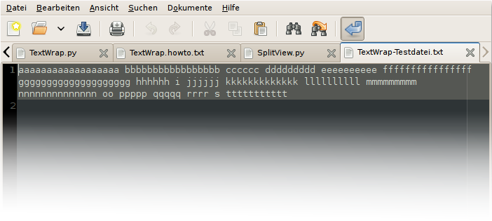
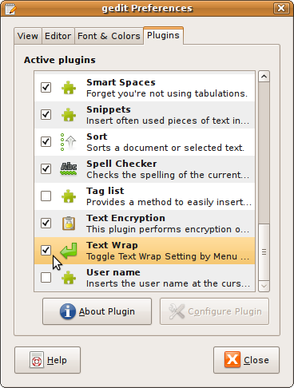

# TextWrap - A Gedit (2) Plugin

TextWrap is a Plugin for the default GNOME text editor gedit, that gives you quick and easy access to the Text Wrap mode currently active (aka , Word Wrap, Line Break, Wrap Lines, Paragraph Wrap etc.) setting of the active document. It inserts an additional entry in the "View" menu for quick access and an icon in the "Toolbar" for even quicker access to it:



Behaviour

Textwrap mode is initialy set to the defaults set in the Preferences dialog for any document when opened as long it is opened in gedit. TextWrap acts as a toggle for the whole Textwrap setting block in the Preferences (i.e. Textwrap enabled or not _and_ if wrapping occurs at word boundaries or not) and therefore toggles between On and Off. TextWrap toggle is kept for every document individualy.
Download

You might want to download the TextWrap plugin in an archive having everything and unpack the archiv to a place of your choice (your home directory is used herein as an example).

Or if you know what you're doing you might download the minimal files needed directly:

    TextWrap.gedit-plugin
    TextWrap.py

Install
General procedure

    download the archiv
    unpack the archiv
    create your personal gedit plugin directory (if it does not exists)
    copy files needed to your personal gedit plugin directory
    activate the plugin

The procedure in commands (after download)

From inside your ( Applications -> Accesories -> ) Terminal application type (or grab commands from here and insert there):

```
$ cd
$ tar -xf TextWrap-Gedit-Plugin-0.2.1.tar.gz
$ cd TextWrap-Gedit-Plugin-0.2.1
$ test -d ~/.gnome2/gedit/plugins || mkdir ~/.gnome2/gedit/plugins
$ cp TextWrap.py TextWrap.gedit-plugin ~/.gnome2/gedit/plugins/
```

Activate the plugin (optional):

$ gconftool --get /apps/gedit-2/plugins/active-plugins | grep "TextWrap" >/dev/null ||
( OLDVALUE=$(gconftool --get /apps/gedit-2/plugins/active-plugins);
NEWVALUE=$(echo $OLDVALUE | sed 's/\[/\[TextWrap,/');
gconftool --set --type=list --list-type=string /apps/gedit-2/plugins/active-plugins $NEWVALUE )

or do it through the Preferences dialog:



Chicken (aka Windows) Installation

if the commands above scare you, you might download this minimalistic install script and execute it. you might execute it by double clicking on the downloaded file named TextWrap-SETUP.sh. otherwise you have to open a command prompt (window) and execute it by entering 'sh TextWrap-SETUP.sh' into it. USE ON YOUR OWN RISK
Keyboard Shortcut

Currently hardcoded to: Shift-Ctrl-B. The Keyboard Shortcut is setable through Hannes Matuschek's plugin Edit Shortcuts. Scroll down to 'PluginActions' and find TextWrap there. (If you have troubles with setting - as me on the first try - edit ~/.gnome2/accels/gedit)
BUGS

    Icon does not update on textwrap setting change in Preferences dialog if no document opened (although it updates correctly after first doc opened)

TODO

    Translations for Name and Description in the Preferences dialog (help with TextWrap Translations in Launchpad)
    Toolbar- and Menu-Text shall adopt to language setting (currently fixed to: "Text Wrap")
    Build DEB and RPM packages
    Keyboard Shortcut adoptable through gconf (currently fixed to Shift-Ctrl-B). Actualy i believe a Function Key is more preferable as any Ctrl- or Shift- based approach, since all other View related Shortcuts are Function Keys. Others are proposing Ctrl-R, but IMHO this should be restricted to Reload Action such as F5
    Setting for every individualy document might get persistent over sessions by keeping track of it in a (XML) list, comparable to the list of ever opened files, that the LRU list is taken from
    might get an icon that look more familiar to users of other platforms or more consistent with different text writer applications. But then this might cause problems for people with visual impairments.
    use heuristic method to en- or disable text wrap for source code and non-source code files
    include a setup dialog to setup various aspects (if it will have more than now)
    might have a status indicator in the status bar (if toolbar is disabled)

Other gedit plugins dealing with the same issue

    "Menu Text Wrapping" by Henrique Rodrigues
    "Toggle text wrapping" by Javier Paniagua
    "Word Wrap Menu" by Nando Vieira
    "Rewrap Paragraph by Tom Insam (trying to respect line indenting and prefixing)
    "Per Buffer Text Wrap" by Karl Ostmo (shows wrapping state in the status bar)

Other gedit plugins recommended

Contact

gedit (@) hartmann-it-design (.) de
License

TextWrap is licensed under the GNU General Public License 3
Logo GPL 3 
